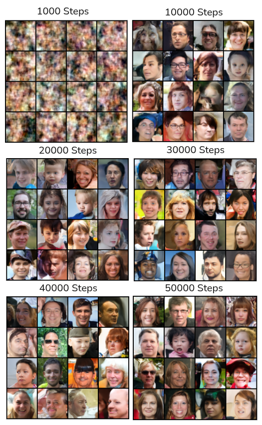

# Diffusion Tutorial

This repository is a fork of [EdwardFerdian/diffusion_tutorial](https://github.com/EdwardFerdian/diffusion_tutorial). The original README is kept in `README.old.md`.

This project trains a 2D denoising diffusion model using `scripts/trainer_2d.py`.

## Setup

This project uses `uv` for dependency management. If `uv` is not installed yet, follow the official installation guide:

https://docs.astral.sh/uv/getting-started/installation/

The current `pyproject.toml` is configured to install PyTorch with CUDA 12.8 wheels.

```bash
uv sync
source .venv/bin/activate
```

## Dataset

The dataset used is the NVIDIA FFHQ dataset:

https://github.com/nvlabs/ffhq-dataset

This experiment uses the 128x128 image version, containing 70,000 face images.

After training starts, the images are resized/cropped by the training pipeline to `64 x 64`.

## Download Dataset

Run:

```bash
python download.py
```

This downloads the 128x128 FFHQ image archive and extracts it into the `images/` folder.

## Run Training

Run:

```bash
python scripts/trainer_2d.py --data-dir images --output-dir models --channels 3
```

Training checkpoints and sample images will be written to the output directory.

## Hardware and Parameters

- GPU: RTX 5070 Ti
- CPU: Ryzen 7 8700F
- RAM: 64 GB
- Input size: `64 x 64`
- Output size: `64 x 64`
- Training steps: `50,000`
- Batch size: `32`

## Results

Result from every 1,000 steps is saved on [results/](results/)

The generated samples improve clearly as training progresses:



- `1,000` steps: samples are still mostly noisy color patterns, with no clear face structure.
- `10,000` steps: face-like shapes start to appear, but many samples are blurry or distorted.
- `20,000` steps: faces become more recognizable, with clearer eyes, hair, and head shapes.
- `30,000` steps: samples are sharper and more consistent, with better facial alignment.
- `40,000` steps: most samples look like realistic face thumbnails, although some artifacts remain.
- `50,000` steps: samples are the most stable and recognizable, with the best overall face quality in this run.

**Total Training time: `3:05:21`**
